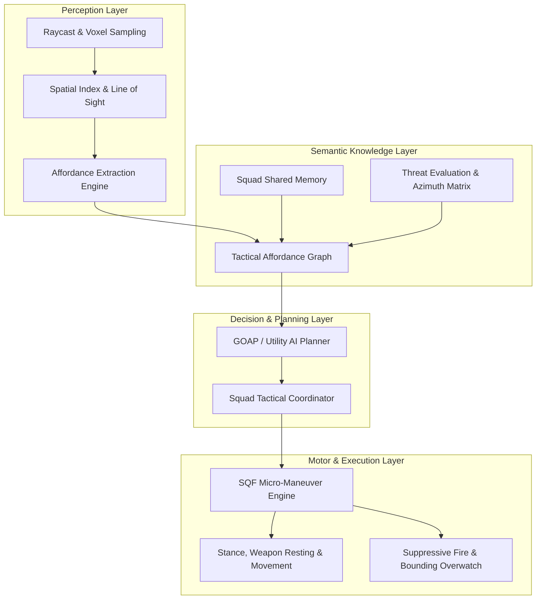

# Arma AI: Semantic Affordance AI for Arma 3

[](LICENSE)
[](https://github.com/BrettMayson/HEMTT)
[](https://community.bistudio.com/wiki/SQF_Syntax)

> **Moving beyond brittle finite state machines:** Arma AI introduces an affordance-based, semantic reasoning architecture for tactical AI agents in the Bohemia Interactive Real Virtuality 4 engine.

---

## 🎯 Manifesto: The Problem with Traditional Imperative AI

For over two decades, tactical AI in military simulations has relied predominantly on **imperative scripting** and **hierarchical Finite State Machines (FSMs)**:

1. **Brittle Reactive Logic**: Units are commanded with imperative verbs (`doMove`, `doFire`, `commandSuppressiveFire`) tied to hardcoded trigger zones or fixed waypoint loops. When unexpected environmental conditions arise, these state machines collapse into rigid, unnatural behavior (e.g., staring at walls, running into open fire, or ignoring flanking routes).
2. **Ignorance of Environmental Affordances**: Vanilla AI perceives the world as basic geometric obstacles and visibility checks rather than understanding *what objects afford to tactical agents* (e.g., low stone walls afford kneeling fire; window sills afford weapon resting; vehicle hulks afford defilade from specific threat azimuths; narrow doorways afford kill-zones for defensive ambushes).
3. **Micro-Management vs. Autonomous Tactical Reasoning**: Mission designers are forced to micromanage individual unit movements instead of giving high-level tactical intents (e.g., *"Establish a support-by-fire position along Ridge Charlie to suppress the crossroads"*).

### The Solution: Semantic & Affordance-Based AI

**Arma AI** shifts AI decision-making from *procedural execution* to *semantic ecological perception*:
- **Affordance Theory (Gibson's Ecological Psychology)**: Rather than querying raw geometry, agents perceive actionable properties of their surroundings—cover quality relative to known threats, enfilade corridors, bounding waypoints, and egress routes.
- **Semantic World Representation**: Spatial indexes and semantic graphs provide high-level contextual awareness (e.g., identifying choke points, tactical vantage points, interior rooms, and concealment zones).
- **Utility & Goal-Oriented Action Planning (GOAP)**: Squads evaluate competing tactical actions based on dynamic utility curves, allowing emergent fire-and-movement tactics, coordinated bounding overwatch, dynamic breach-and-clear maneuvers, and intelligent retreat under smoke.

---

## 🏛️ System Architecture



### Key Subsystems

- **Perception Layer (`AAI_fnc_perception`)**: High-performance scheduled/unscheduled spatial scanning, surface normal extraction, dynamic cover evaluation, and threat line-of-sight tracking.
- **Affordance Engine (`AAI_fnc_affordance`)**: Classifies terrain, static objects, buildings, and vehicles into semantic tactical affordances (`CoverLow`, `CoverHigh`, `WeaponRest`, `PeekingPort`, `ChokePoint`, `Concealment`).
- **Tactical Planner (`AAI_fnc_planner`)**: Utility-driven behavior selection that balances survivability, mission objectives, squad cohesion, and ammunition expenditure.
- **Execution Controller (`AAI_fnc_motor`)**: Micro-maneuver execution using custom stance interpolation, suppressive fire intervals, synchronized bounding, and vehicle coordination.

---

## 📂 Repository Structure

```text
arma-ai/
├── tools/                   # Developer tooling, environment scripts & configs
│   ├── setup_dev_env.sh     # Quickstart setup script
│   └── vscode/              # VS Code settings and extension recommendations
├── src/                     # Core SQF engine modules
│   ├── grounding/           # 3D spatial grounding, cover shadows, stance affordances
│   ├── controller/          # Agent behavior controller, tactical tick, movement execution
│   └── debug/               # Real-time 3D overlay visualizers (drawTacticalOverlay)
├── ontology/                # Formal semantic ontologies (OWL / RDF Turtle)
│   └── tactical_infantry_core.ttl # Infantry affordances and tactical concept triples
├── docs/                    # Architectural specifications and developer guides
│   ├── setup_and_tooling.md # Comprehensive developer guide (macOS & Windows)
│   ├── architecture_grounding.md # Spatial grounding & bounding box mathematics
│   └── tactical_ontology_spec.md # Tactical ontology & affordance specifications
├── missions/                # Sandbox missions for in-engine testing
│   └── VR_Tactical_Sandbox.VR/ # VR testing ground for AI affordance evaluation
│       ├── mission.sqm      # Eden Editor mission file
│       ├── description.ext  # Mission configuration & CfgFunctions declarations
│       └── init.sqf         # Mission initialization & sandbox scenario setup
├── hemtt.toml               # HEMTT modern build system configuration
└── README.md                # Project manifesto and documentation root
```

---

## ⚡ Quick Start

### Prerequisites
- **Arma 3** (v2.14+ recommended)
- **VS Code** with the `SQF Language Support` extension
- **HEMTT** (Modern Rust-based Arma 3 build tool)
- **Git**

### 1. Clone the Repository
```bash
git clone https://github.com/clementd/arma-ai.git
cd arma-ai
```

### 2. Build the Addon with HEMTT
```bash
# Check syntax and run HEMTT linter
hemtt check

# Build development PBOs
hemtt build --dev
```

### 3. Load the Sandbox Mission
1. Symlink or copy the `missions/VR_Tactical_Sandbox.VR` directory to your Arma 3 missions folder:
   - **Windows**: `%USERPROFILE%\Documents\Arma 3 - Other Profiles\<ProfileName>\missions\`
   - **macOS**: `~/Library/Application Support/com.bohemia-interactive.arma3/missions/`
2. Launch Arma 3 with the built `@arma-ai` mod enabled.
3. Open the **Eden Editor**, select the **Virtual Reality (VR)** map, and open `VR_Tactical_Sandbox`.
4. Press **Play Scenario (in Single Player)** (`Ctrl + Enter`).

For detailed cross-platform instructions and troubleshooting, see [docs/setup_and_tooling.md](file:///Users/clementd/Documents/GitHub/arma-ai/docs/setup_and_tooling.md).

---

## 🗺️ Development Roadmap

- [x] **Phase 0: Project Setup & Tooling**
  - HEMTT build pipeline and linting configurations.
  - Cross-platform developer guide (macOS + Windows).
  - VS Code workspace environment and file associations.
- [ ] **Phase 1: Spatial Perception & Dynamic Cover Affordances**
  - Voxelized terrain and object sampling.
  - Directional cover scoring with threat azimuth cones.
  - Weapon-resting and dynamic stance alignment.
- [ ] **Phase 2: Tactical Affordance Knowledge Graph & Squad Cohesion**
  - Squad-shared memory and spatial threat indexing.
  - Bounding overwatch and synchronized movement planners.
  - Suppressive fire corridors and defilade traversal.
- [ ] **Phase 3: Urban CQB & Interior Room Clearing**
  - Building structure graph (entry points, rooms, window fields-of-fire).
  - High-threat corner peeking and room-clearing state trees.
  - Breach, flash, and entry coordination.
- [ ] **Phase 4: High-Level Autonomy & External Reasoning Interfaces**
  - Commander-level AI intent decomposition.
  - External interface hooks for real-time telemetry and symbolic reasoning.

---

## 🤝 Contributing & Guidelines

1. **Coding Standards**: All SQF code must follow the standard naming convention: `AAI_fnc_<subsystem>_<action>` (e.g., `AAI_fnc_affordance_findCover`).
2. **Scheduling Rules**: Time-critical spatial math must run unscheduled (`call`). Long-running background loops must run in scheduled workers (`spawn`) with explicit yield points (`sleep` / `uiSleep`).
3. **Locality**: Follow strict network locality paradigms—AI motor commands must execute where the unit is local (`local _unit`).
4. **Validation**: Run `hemtt check` before submitting pull requests to ensure clean syntax and no missing dependencies.

---

## 📄 License

This project is licensed under the MIT License — see the [LICENSE](LICENSE) file for details.
