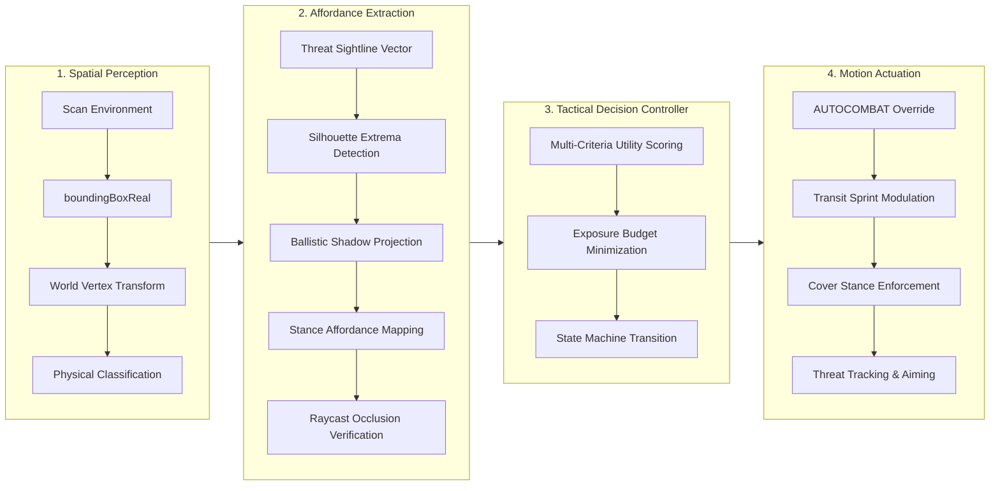
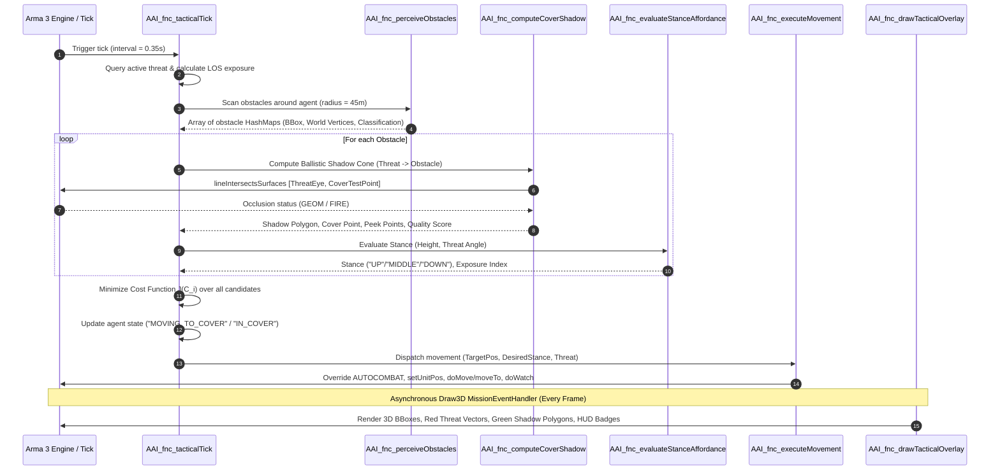

# Arma-AI: SQF Spatial Grounding Engine & Tactical Controllers Architecture

This document specifies the technical architecture, mathematical formulations, geometric derivations, and execution workflows for the **Arma-AI SQF Grounding Engine**, the **Tactical Decision Controller**, and the **3D Viewport Debug Visualizer** in Arma 3.

---

## 1. Executive Summary & Design Philosophy

Traditional game AI systems rely on hardcoded pathing nodes or precomputed cover graphs (e.g., navigation meshes with static cover flags). In dynamic tactical combat environments, precomputed graphs suffer from severe limitations:
1. **Dynamic Obstacles**: Destructible buildings, movable vehicles, micro-terrain, or user-spawned obstacles are not represented.
2. **Dynamic Threats**: Cover is inherently directional and relativistic. A concrete wall is safe cover relative to a threat at azimuth $0^\circ$, but offers zero protection if the threat maneuvers to azimuth $90^\circ$.
3. **Continuous Stance Physics**: Infantry combatants have continuous physical dimensions across multiple postures (Stand $\approx 1.8\text{m}$, Crouch $\approx 1.1\text{m}$, Prone $\approx 0.4\text{m}$). An obstacle's tactical utility is tightly coupled to whether its vertical bounding profile occludes the threat's line of sight for a specific stance.

The **Arma-AI Grounding Engine** resolves this via **Real-Time Spatial Grounding**: extracting geometric bounding hulls directly from the physics simulation, extruding ballistic shadow cones relative to instantaneous threat vectors, and mapping continuous heights to discrete engine affordances.



---

## 2. Mathematical Formulations & Geometric Algorithms

### 2.1 Bounding Box Model-to-World Coordinate Transformation

For each detected physical object $\mathcal{O}$, the engine queries its model-space oriented bounding box:
$$\text{bbox}(\mathcal{O}) = [\mathbf{p}_{\min}, \mathbf{p}_{\max}], \quad \mathbf{p}_{\min} = [x_1, y_1, z_1]^T, \; \mathbf{p}_{\max} = [x_2, y_2, z_2]^T$$

The dimensions along local axes are:
$$\Delta x = |x_2 - x_1|, \quad \Delta y = |y_2 - y_1|, \quad \Delta z = |z_2 - z_1|$$

The 8 bounding box vertices in local model coordinates $\mathbf{V}_{\text{model}} = \{\mathbf{v}_0, \dots, \mathbf{v}_7\}$ are defined as:
$$\begin{aligned}
\mathbf{v}_0 &= [x_1, y_1, z_1]^T, & \mathbf{v}_1 &= [x_2, y_1, z_1]^T, & \mathbf{v}_2 &= [x_2, y_2, z_1]^T, & \mathbf{v}_3 &= [x_1, y_2, z_1]^T \\
\mathbf{v}_4 &= [x_1, y_1, z_2]^T, & \mathbf{v}_5 &= [x_2, y_1, z_2]^T, & \mathbf{v}_6 &= [x_2, y_2, z_2]^T, & \mathbf{v}_7 &= [x_1, y_2, z_2]^T
\end{aligned}$$

Using the object's transformation matrix $\mathbf{M}_{\mathcal{O}} = [\mathbf{R}_{\mathcal{O}} \mid \mathbf{T}_{\mathcal{O}}]$, each vertex is transformed into World Space (ATL) via `modelToWorldVisual`:
$$\mathbf{v}_{i,\text{world}} = \mathbf{R}_{\mathcal{O}} \cdot \mathbf{v}_{i,\text{model}} + \mathbf{T}_{\mathcal{O}}$$

---

### 2.2 Ballistic Cover Shadow & Silhouette Extrusion

Given a threat position $\mathbf{P}_{\text{threat}} \in \mathbb{R}^3$ and an obstacle geometric center $\mathbf{P}_{\text{obs}} \in \mathbb{R}^3$, the horizontal threat direction vector $\hat{\mathbf{u}}_{\text{threat}}$ and perpendicular lateral axis $\hat{\mathbf{u}}_{\perp}$ are:

$$\mathbf{d}_{\text{threat}} = \mathbf{P}_{\text{obs}} - \mathbf{P}_{\text{threat}}, \quad \hat{\mathbf{u}}_{\text{threat}} = \frac{[d_x, d_y, 0]^T}{\|[d_x, d_y, 0]^T\|_2}, \quad \hat{\mathbf{u}}_{\perp} = [-\hat{u}_y, \hat{u}_x, 0]^T$$

#### Silhouette Extremities:
Projecting each ground vertex $\mathbf{c}_i \in \{\mathbf{v}_0, \mathbf{v}_1, \mathbf{v}_2, \mathbf{v}_3\}_{\text{world}}$ onto the lateral axis:
$$\pi_i = (\mathbf{c}_i - \mathbf{P}_{\text{obs}}) \cdot \hat{\mathbf{u}}_{\perp}$$
The silhouette bounding points are identified by extrema:
$$\mathbf{E}_{\text{left}} = \arg\min_{\mathbf{c}_i} (\pi_i), \quad \mathbf{E}_{\text{right}} = \arg\max_{\mathbf{c}_i} (\pi_i)$$

#### Safe Ballistic Shadow Volume:
The shadow cone extends behind the obstacle opposite to the threat sightline:
$$\hat{\mathbf{d}}_{\text{threat}\to\text{left}} = \frac{\mathbf{E}_{\text{left}} - \mathbf{P}_{\text{threat}}}{\|\mathbf{E}_{\text{left}} - \mathbf{P}_{\text{threat}}\|_2}, \quad \hat{\mathbf{d}}_{\text{threat}\to\text{right}} = \frac{\mathbf{E}_{\text{right}} - \mathbf{P}_{\text{threat}}}{\|\mathbf{E}_{\text{right}} - \mathbf{P}_{\text{threat}}\|_2}$$

For shadow depth $\lambda_{\text{depth}} \approx 6.0\text{m}$:
$$\mathbf{S}_{\text{left}} = \mathbf{E}_{\text{left}} + \lambda_{\text{depth}} \cdot \hat{\mathbf{d}}_{\text{threat}\to\text{left}}, \quad \mathbf{S}_{\text{right}} = \mathbf{E}_{\text{right}} + \lambda_{\text{depth}} \cdot \hat{\mathbf{d}}_{\text{threat}\to\text{right}}$$

The safe 2D ground footprint polygon is:
$$\mathcal{P}_{\text{safe}} = \text{Polygon}(\mathbf{E}_{\text{left}}, \mathbf{E}_{\text{right}}, \mathbf{S}_{\text{right}}, \mathbf{S}_{\text{left}})$$

#### Primary Cover Anchor Point:
With rear face centroid $\bar{\mathbf{P}}_{\text{back}}$ and clearance standoff distance $d_{\text{standoff}} \approx 0.85\text{m}$:
$$\mathbf{P}_{\text{cover}} = \bar{\mathbf{P}}_{\text{back}} + d_{\text{standoff}} \cdot \hat{\mathbf{u}}_{\text{threat}}$$

#### Left/Right Peek Offsets:
$$\mathbf{P}_{\text{peekLeft}} = \mathbf{E}_{\text{left}} - \delta_{\text{lat}} \hat{\mathbf{u}}_{\perp} + \delta_{\text{back}} \hat{\mathbf{u}}_{\text{threat}}$$
$$\mathbf{P}_{\text{peekRight}} = \mathbf{E}_{\text{right}} + \delta_{\text{lat}} \hat{\mathbf{u}}_{\perp} + \delta_{\text{back}} \hat{\mathbf{u}}_{\text{threat}}$$

```
               [THREAT] (P_threat)
                  |
                  |  Threat Vector (u_threat)
                  v
           +--------------+
           |   OBSTACLE   |
 E_left -> +--------------+ <- E_right
    \             |            /
     \       [P_cover]        /
      \           |          /
       \   BALLISTIC SHADOW /
        \     SAFE ZONE    /
         \                /
   S_left +--------------+ S_right
```

---

### 2.3 Stance Affordance Decision Function

The posture required to remain below the obstacle crest is governed by the effective height $h_{\text{eff}} = \Delta z$:

$$\text{Affordance}(h_{\text{eff}}) = \begin{cases}
\text{STAND} \quad (\text{unitPos "UP"}), & h_{\text{eff}} \ge 1.80\,\text{m} \\
\text{CROUCH} \quad (\text{unitPos "MIDDLE"}), & 0.90\,\text{m} \le h_{\text{eff}} < 1.80\,\text{m} \\
\text{PRONE} \quad (\text{unitPos "DOWN"}), & 0.40\,\text{m} \le h_{\text{eff}} < 0.90\,\text{m} \\
\text{EXPOSED} \quad (\text{unitPos "AUTO"}), & h_{\text{eff}} < 0.40\,\text{m}
\end{cases}$$

#### Plunging Fire / Elevation Correction:
When a threat is elevated at angle $\theta_{\text{elev}} = \arctan\left(\frac{z_{\text{threat}} - z_{\text{cover}}}{d_{2D}}\right) > 15^\circ$, the effective apparent cover height drops:
$$h_{\text{apparent}} = h_{\text{eff}} - \left(\frac{\theta_{\text{elev}} - 15^\circ}{45^\circ}\right) \cdot 0.40\,\text{m}$$

---

### 2.4 Multi-Criteria Cover Utility & Cost Optimization

Given candidate cover points $\mathcal{C} = \{C_1, C_2, \dots, C_K\}$, the agent selects $C^* = \arg\min_{C_i \in \mathcal{C}} \mathcal{J}(C_i)$:

$$\mathcal{J}(C_i) = w_{\text{dist}} \cdot d(\mathbf{P}_{\text{agent}}, \mathbf{P}_{C_i}) + w_{\text{exp}} \cdot \text{Exposure}(C_i) + \Omega_{\text{LOS}}(C_i) + \Phi_{\text{prox}}(C_i) - w_q \cdot Q(C_i) - w_h \cdot \min(h_i, 2.0)$$

Where:
- $d(\mathbf{P}_{\text{agent}}, \mathbf{P}_{C_i})$: Horizontal Euclidean distance from agent to candidate cover.
- $\text{Exposure}(C_i) \in [0, 1]$: Exposure index based on stance affordance (Stand: 0.05, Crouch: 0.15, Prone: 0.35, Exposed: 0.90).
- $\Omega_{\text{LOS}}(C_i)$: Hard raycast penalty ($+20.0$ if raycast `lineIntersectsSurfaces` reveals unobstructed direct LOS from threat eye to cover test point).
- $\Phi_{\text{prox}}(C_i)$: Penalty for running directly adjacent to threat ($\max(0, 6.0 - d_{\text{threat}\to C_i}) \cdot 3.0$).
- $Q(C_i) \in [0, 1]$: Quality score incorporating material solidity, width, and vertical occlusion.
- $h_i$: Obstacle vertical dimension (bonus for tall cover offering sprint exit speed).

---

## 3. Component Architecture & SQF Implementation

### 3.1 Module Breakdown

| Module | File Path | Tagged Function | Primary Responsibility |
| :--- | :--- | :--- | :--- |
| **Perception** | `src/grounding/fn_perceiveObstacles.sqf` | [`AAI_fnc_perceiveObstacles`](file:///Users/clementd/Documents/GitHub/arma-ai/src/grounding/fn_perceiveObstacles.sqf) | Spatial scan, `boundingBoxReal` extraction, 3D vertex transform, physical classification. |
| **Shadow Geometry** | `src/grounding/fn_computeCoverShadow.sqf` | [`AAI_fnc_computeCoverShadow`](file:///Users/clementd/Documents/GitHub/arma-ai/src/grounding/fn_computeCoverShadow.sqf) | Ballistic shadow cone extrusion, silhouette edge finding, cover anchor & peek point generation, `lineIntersectsSurfaces` raycast check. |
| **Stance Affordance** | `src/grounding/fn_evaluateStanceAffordance.sqf` | [`AAI_fnc_evaluateStanceAffordance`](file:///Users/clementd/Documents/GitHub/arma-ai/src/grounding/fn_evaluateStanceAffordance.sqf) | Height-to-posture mapping (`UP`, `MIDDLE`, `DOWN`), exposure rating, plunging fire correction. |
| **Tactical Cycle** | `src/controller/fn_tacticalTick.sqf` | [`AAI_fnc_tacticalTick`](file:///Users/clementd/Documents/GitHub/arma-ai/src/controller/fn_tacticalTick.sqf) | Periodic decision cycle, threat evaluation, utility optimization, state management. |
| **Actuation** | `src/controller/fn_executeMovement.sqf` | [`AAI_fnc_executeMovement`](file:///Users/clementd/Documents/GitHub/arma-ai/src/controller/fn_executeMovement.sqf) | Speed & posture actuation, `AUTOCOMBAT` hesitation override, transit sprint vs in-cover stance. |
| **Lifecycle Manager** | `src/controller/fn_startAgentController.sqf` | [`AAI_fnc_startAgentController`](file:///Users/clementd/Documents/GitHub/arma-ai/src/controller/fn_startAgentController.sqf) | Spawns and manages the autonomous agent execution thread. |
| **3D Visualizer** | `src/debug/fn_drawTacticalOverlay.sqf` | [`AAI_fnc_drawTacticalOverlay`](file:///Users/clementd/Documents/GitHub/arma-ai/src/debug/fn_drawTacticalOverlay.sqf) | Real-time viewport rendering (`Draw3D`) of 3D boxes, threat rays, shadow cones, affordance badges. |

---

## 4. Sequence of Operations



---

## 5. Performance Optimizations & SQF Best Practices

1. **HashMaps vs Associated Lists**:
   Uses Arma 3 native HashMaps (`createHashMapFromArray`, `get`, `set`, `getOrDefault`) introduced in 2.02, providing $O(1)$ property lookups without string array parsing overhead.
2. **Raycast Throttling**:
   `lineIntersectsSurfaces` is restricted to only 1 raycast per candidate cover point using `maxHits = 1` and LOD flags `"GEOM", "FIRE"`.
3. **Vanilla AI Hesitation Suppression**:
   Vanilla Arma 3 AI exhibits pathological behavior under direct fire (the `AUTOCOMBAT` FSM state forces units to drop prone in the open and crawl backward). `fn_executeMovement.sqf` actively disables `AUTOCOMBAT` via `_unit disableAI "AUTOCOMBAT"`, enforcing decisive sprint movement toward cover.
4. **Draw3D Coordinate Safety**:
   All 3D vector lines in `fn_drawTacticalOverlay.sqf` are explicitly transformed through `ATLToASL` to prevent clipping or elevation displacement across diverse terrains and VR worlds.

---

## 6. VR Sandbox Verification & Interactive Controls

The sandbox mission is located at [`missions/VR_Tactical_Sandbox.VR/`](file:///Users/clementd/Documents/GitHub/arma-ai/missions/VR_Tactical_Sandbox.VR/):
- **Tall Blocks (`Land_VR_Block_03_F`, $h \ge 1.8\text{m}$)**: Verify `STAND` affordance and standing peek/aim behavior.
- **Medium Blocks (`Land_VR_Block_02_F`, $h \approx 1.1\text{m}$)**: Verify `CROUCH` affordance and crest peeking.
- **Low Barriers (`Land_VR_CoverObject_01_kneel_F`, $h \approx 0.6\text{m}$)**: Verify `PRONE` affordance and low crawl ingress.

### In-Game Player Actions:
- **`[AAI] Toggle 3D Debug Visualizer`**: Enable/disable real-time 3D overlay rendering.
- **`[AAI] Move Threat: Flank Left / Right (+15m)`**: Moves the threat laterally to observe dynamic shadow cone recalculation and agent repositioning.
- **`[AAI] Move Threat: Elevate (+8m Plunging Fire)`**: Elevates threat to test roofline exposure and stance degradation.
- **`[AAI] Spawn Dynamic VR Block`**: Instantiates a new VR obstacle in the world; the agent immediately includes it in the next perception tick.
