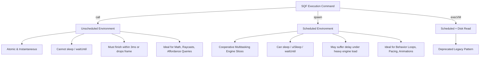
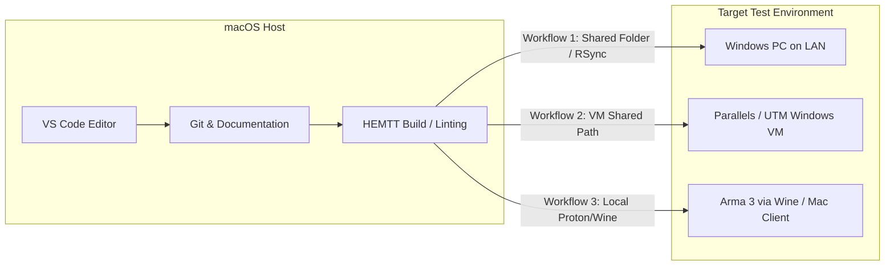

# Developer Setup & Tooling Guide

Welcome to the **Arma AI** development documentation. This guide is tailored for developers of all experience levels—especially those starting from scratch on **macOS** or **Windows**—who want to build, test, and contribute to Arma 3 mods and SQF-based tactical AI systems.

---

## Table of Contents

1. [SQF 101: The Arma Scripting Language](#1-sqf-101-the-arma-scripting-language)
   - [What is SQF?](#what-is-sqf)
   - [Scripts vs. Functions (CfgFunctions)](#scripts-vs-functions-cfgfunctions)
   - [Scheduling: `call` vs. `spawn` vs. `execVM`](#scheduling-call-vs-spawn-vs-execvm)
   - [Locality & Network Execution](#locality--network-execution)
   - [Data Types, Variables & Modern SQF Features](#data-types-variables--modern-sqf-features)
2. [Modern Tooling Ecosystem](#2-modern-tooling-ecosystem)
   - [HEMTT Build System](#hemtt-build-system)
   - [Visual Studio Code Configuration](#visual-studio-code-configuration)
   - [SQFLint & Code Quality](#sqflint--code-quality)
   - [Arma 3 Tools vs. Modern Alternatives](#arma-3-tools-vs-modern-alternatives)
3. [macOS & Cross-Platform Development](#3-macos--cross-platform-development)
   - [Developing on macOS](#developing-on-macos)
   - [Syncing Missions & Addons to Arma 3](#syncing-missions--addons-to-arma-3)
   - [Automation Scripts (rsync / symlinks)](#automation-scripts-rsync--symlinks)
4. [In-Game Testing & Debugging](#4-in-game-testing--debugging)
   - [Loading `VR_Tactical_Sandbox.VR` in Eden Editor](#loading-vr_tactical_sandboxvr-in-eden-editor)
   - [Using the In-Game Debug Console](#using-the-in-game-debug-console)
   - [Inspecting the `.rpt` (Report) Log File](#inspecting-the-rpt-report-log-file)
   - [Interactive Debug Commands & Performance Profiling](#interactive-debug-commands--performance-profiling)

---

## 1. SQF 101: The Arma Scripting Language

### What is SQF?

**SQF** (*Status Quo Function*) is the primary domain-specific scripting language of Bohemia Interactive's **Real Virtuality 4** engine powering Arma 3. SQF is:
- **Expression-based**: Almost every statement evaluates to a value.
- **Dynamically typed & Case-insensitive**: Variable types are determined at runtime, and identifiers like `myVar`, `MYVAR`, and `MyVar` refer to the same symbol.
- **Vector & Geometry native**: Built-in 3D vector arithmetic (`vectorAdd`, `vectorCrossProduct`, `vectorModelToWorld`, `lineIntersectsSurfaces`).

```sqf
// Example: Basic vector calculation in SQF
private _origin = getPosASL player;
private _target = _origin vectorAdd [0, 50, 2];
private _intersects = lineIntersectsSurfaces [_origin, _target, player];
```

---

### Scripts vs. Functions (CfgFunctions)

In modern Arma 3 development, loose scripts (`.sqf` files executed with `execVM`) are discouraged in favor of **compiled functions** registered in `CfgFunctions`.

| Feature | Loose Script (`execVM`) | CfgFunctions Compiled Function |
| :--- | :--- | :--- |
| **Parsing** | Re-read and parsed from disk on every invocation. | Read and compiled once into memory at game startup. |
| **Execution** | Always runs in *scheduled* environment. | Can run *unscheduled* (`call`) or *scheduled* (`spawn`). |
| **Performance** | High disk/PBO I/O overhead; slower. | Instantaneous memory access; zero disk overhead. |
| **Scope / Tagging** | Global namespace pollution risk. | Strict prefixing: `<Tag>_fnc_<Name>`. |

#### How `CfgFunctions` Works

Functions are declared in `config.cpp` (for addons) or `description.ext` (for missions):

```cpp
class CfgFunctions {
    class AAI { // Tag
        tag = "AAI";
        class Affordance { // Category
            file = "z\aai\addons\main\functions\affordance";
            class findCover {};             // Defines AAI_fnc_findCover
            class evaluateVantagePoints {}; // Defines AAI_fnc_evaluateVantagePoints
        };
        class Perception {
            file = "z\aai\addons\main\functions\perception";
            class scanVoxelGrid {};         // Defines AAI_fnc_scanVoxelGrid
            class initPerception { preInit = 1; }; // Automatically runs before mission start
        };
    };
};
```

When declared:
- Arma automatically compiles the file `functions/affordance/fn_findCover.sqf` into the global variable `AAI_fnc_findCover`.
- `preInit = 1` functions execute before the map objects initialize.
- `postInit = 1` functions execute right as the mission starts.

---

### Scheduling: `call` vs. `spawn` vs. `execVM`

Understanding engine scheduling is the single most important concept in high-performance SQF programming.



#### Detailed Comparison

1. **`call` (Unscheduled / Atomic)**:
   - Executes synchronously on the main simulation thread.
   - Guaranteed to complete before the next frame is rendered.
   - **Constraint**: You *cannot* use `sleep`, `uiSleep`, or `waitUntil` inside unscheduled code (doing so will trigger an engine script error).
   - **Use Case**: Sensor queries, vector math, tactical scoring, affordance evaluation algorithms.
   ```sqf
   private _bestCover = [_unit, _threatPos, 50] call AAI_fnc_findCover;
   ```

2. **`spawn` (Scheduled / Coroutine)**:
   - Suspended into the engine's scheduled script queue. The engine allocates small execution slices (up to ~3ms per frame) to scheduled threads.
   - Supports `sleep <seconds>` (simulation time) and `uiSleep <seconds>` (real-world UI time).
   - **Constraint**: If server FPS drops, scheduled threads may experience delays before their next slice executes.
   - **Use Case**: Continuous AI patrol loops, suppressive fire burst timing, weapon reload state machines.
   ```sqf
   [_unit, _target] spawn {
       params ["_unit", "_target"];
       while {alive _unit && alive _target} do {
           [_unit, _target] call AAI_fnc_motor_suppressTarget;
           sleep 2.5; // Engine yields execution safely
       };
   };
   ```

3. **`execVM` (Scheduled + File I/O)**:
   - Similar to `spawn`, but re-reads and compiles the script file from disk/PBO each time.
   - **Avoid in production code**; only use for quick manual testing in the debug console.

---

### Locality & Network Execution

Arma 3 is a distributed multiplayer engine. Every object in the game is **local** to either the server or a specific client machine:

- **Locality Rule**: A unit's motor commands (e.g., `doMove`, `setUnitPos`, `playMoveNow`, `setDir`) **must** be executed on the machine where that unit is local (`local _unit == true`).
- AI units in Singleplayer or Eden Editor are local to the player (`player`).
- Dedicated Server AI units are local to the server (`isServer == true`).
- Headless Client (HC) AI units are local to the headless client.

#### Remote Execution (`remoteExec` and `remoteExecCall`)

To trigger actions across the network:
```sqf
// Execute AAI_fnc_alertSquad on the machine where _leader is local
[_enemyPos] remoteExec ["AAI_fnc_alertSquad", _leader];

// Execute unscheduled on all connected clients + server (0 = global)
[_markerName, _pos] remoteExecCall ["AAI_fnc_drawDebugMarker", 0];

// Execute on server only (2 = server)
[_reportData] remoteExecCall ["AAI_fnc_serverRecordKill", 2];
```

---

### Data Types, Variables & Modern SQF Features

#### Variable Scope
- **Local Variables (`_varName`)**: Prefixed with an underscore. Scoped to the enclosing code block `{ ... }`. Always declare with `private _varName = ...` to prevent variable shadowing bugs.
- **Global Variables (`varName`)**: Visible across all scripts on the local machine.

#### Key Modern Data Types (Arma 3 v2.00+)
1. **HashMaps (`createHashMap`)**: Key-value store with $O(1)$ lookup time.
   ```sqf
   private _threatMap = createHashMap;
   _threatMap set ["threat_1", [getPosASL enemy1, 0.95]];
   private _val = _threatMap get "threat_1";
   ```
2. **Arrays**: Flexible dynamic arrays.
   ```sqf
   private _covers = [];
   _covers pushBack _pos;
   private _count = count _covers;
   ```
3. **Structured Parameter Extraction (`params`)**:
   ```sqf
   params [
       ["_unit", objNull, [objNull]],
       ["_radius", 50, [0]],
       ["_allowProne", true, [true]]
   ];
   ```

---

## 2. Modern Tooling Ecosystem

### HEMTT Build System

[HEMTT](https://github.com/BrettMayson/HEMTT) (*Heroic Extensive Modular Toolset for Tools*) is a modern, blazingly fast Rust-based build tool for Arma 3 mods. It replaces legacy tools (Addon Builder, BinPBO, Mikero tools) with a single cross-platform binary.

#### Key Features
- Rapid incremental PBO packing.
- Built-in linting for SQF, Cpp, and Rap files.
- Automated versioning, release packaging, and steam workshop publishing.

#### Installation

- **macOS (via cargo or direct download)**:
  ```bash
  # If you have Rust/Cargo installed:
  cargo install hemtt

  # Or download prebuilt universal binary from GitHub releases:
  # https://github.com/BrettMayson/HEMTT/releases
  ```

- **Windows**:
  Download `hemtt.exe` from GitHub releases and place it in your `PATH`, or use `winget` / `cargo`.

#### Essential HEMTT Commands

| Command | Action |
| :--- | :--- |
| `hemtt check` | Runs full static analysis and linting across all `.sqf` and `.cpp` files. |
| `hemtt build` | Compiles source addons into `.pbo` files inside `.hemttout/build/`. |
| `hemtt build --dev` | Fast development build with symbol tables and diagnostic metadata. |
| `hemtt release` | Builds optimized production zip package for distribution. |

---

### Visual Studio Code Configuration

VS Code is the recommended IDE for Arma AI development.

#### Recommended Extensions
1. **SQF Language Support** (`armitxes.sqf` or `bistudio.sqf`): Syntax highlighting, auto-complete, parameter hints, and code snippets.
2. **arma-dev** (`koffeinflummi.arma-dev`): Integration with Arma 3 debug console and build pipelines.
3. **Even Better TOML** (`tamasfe.even-better-toml`): Syntax highlighting and validation for `hemtt.toml`.
4. **Stardog Turtle / RDF** (`stardog-union.stardog-turtle`): Highlighting for `.ttl` tactical ontology files.

---

### SQFLint & Code Quality

HEMTT integrates SQFLint out-of-the-box. Key rules enforced in this repository:
- **No unassigned private variables**: All local variables must be initialized or explicitly declared with `private`.
- **Trailing semicolons**: Statements must terminate with `;`.
- **Correct parameter types**: Functions must validate parameters using `params`.

To run code quality validation locally before committing:
```bash
hemtt check
```

---

## 3. macOS & Cross-Platform Development

Developing Arma 3 mods on **macOS** is fully supported and productive. While the Arma 3 game engine runs on Windows (or via CrossOver / Wine / native Mac legacy port), all code editing, linting, HEMTT builds, git operations, and ontology modeling can be done directly on macOS.

### Development Workflows on Mac

There are three common setups for Mac developers:



1. **Workflow 1: Dual Machine (Mac for Dev + Windows PC for Testing)**
   - Edit SQF in VS Code on your Mac.
   - Use `rsync` or a shared network folder (`SMB`) to sync built addons and mission files to your Windows gaming PC.
2. **Workflow 2: Virtual Machine (Parallels Desktop / UTM on Apple Silicon)**
   - Run Windows 11 on ARM inside Parallels with DirectX 11 support.
   - Symlink your Mac workspace directory into the Windows user profile.
3. **Workflow 3: Native Mac Client / Wine**
   - Place mission files directly into:
     `~/Library/Application Support/com.bohemia-interactive.arma3/missions/`

---

### Syncing Missions & Addons to Arma 3

#### 1. Syncing the Test Sandbox Mission
To edit mission files on Mac and test in Arma 3 without manual copying, create a symlink or use `rsync`:

**macOS Native / Wine Path:**
```bash
# Create symlink to Mac Arma 3 missions directory
ln -s "/Users/clementd/Documents/GitHub/arma-ai/missions/VR_Tactical_Sandbox.VR" \
  "$HOME/Library/Application Support/com.bohemia-interactive.arma3/missions/VR_Tactical_Sandbox.VR"
```

**Syncing to a Remote Windows PC via SSH/rsync:**
```bash
# Example rsync command (replace user & IP with your Windows test machine details)
rsync -avz --delete ./missions/VR_Tactical_Sandbox.VR/ \
  user@192.168.1.50:"/C/Users/Username/Documents/Arma 3 - Other Profiles/DevProfile/missions/VR_Tactical_Sandbox.VR/"
```

---

## 4. In-Game Testing & Debugging

### Loading `VR_Tactical_Sandbox.VR` in Eden Editor

1. Launch **Arma 3**.
2. If testing as a mod, ensure `@arma-ai` (or `.hemttout/build/addons`) is loaded in the Arma 3 Launcher.
3. On the Main Menu, click **EDITOR** (Eden Editor).
4. Choose the map: **Virtual Reality** (`VR`).
5. In the top menu, go to **File** -> **Open** (`Ctrl + O`), and select **`VR_Tactical_Sandbox`**.
6. Press **Play Scenario in Single Player** (`Ctrl + Enter` or click the Play button at the bottom).

---

### Using the In-Game Debug Console

The Debug Console is the primary tool for testing SQF code interactively in real time.

```
+-----------------------------------------------------------------------------------+
| DEBUG CONSOLE                                                                    |
+-----------------------------------------------------------------------------------+
| Code Input:                                                                       |
|   private _cover = [player, getPos (cursorObject), 30] call AAI_fnc_findCover;   |
|   systemChat format ["Cover found at: %1", _cover];                               |
|                                                                                   |
| [ LOCAL EXEC ]     [ GLOBAL EXEC ]     [ SERVER EXEC ]     [ PERFORMANCE ]        |
+-----------------------------------------------------------------------------------+
| Watch 1: diag_fps                          Watch 2: count allUnits                |
| Watch 3: getPos player                     Watch 4: cursorObject                  |
+-----------------------------------------------------------------------------------+
```

#### How to Access:
- In Singleplayer or Eden Editor preview, press `Esc`. The Debug Console appears in the center of the pause menu.
- **Code Execution Buttons**:
  - **Local Exec**: Runs the SQF snippet on your local client machine immediately.
  - **Global Exec**: Broadcasts the snippet to all clients and the server via `remoteExec`.
  - **Server Exec**: Runs the snippet only on the server/host machine.
- **Watch Fields**:
  - Enter SQF expressions (e.g., `getPosASL player`, `cursorObject`, `speed vehicle player`, `diag_activeScripts`) to monitor their values continuously in real time.

---

### Inspecting the `.rpt` (Report) Log File

All output from `diag_log`, script crashes, syntax errors, and engine diagnostics are recorded in the Arma 3 `.rpt` log file.

#### Log File Locations:

- **macOS Native**:
  `~/Library/Application Support/com.bohemia-interactive.arma3/arma3.rpt`
  or
  `~/Library/Logs/Arma 3/`

- **Windows**:
  `%LOCALAPPDATA%\Arma 3\Arma3_x64_*.rpt`
  (e.g., `C:\Users\<User>\AppData\Local\Arma 3\`)

- **Proton / Steam Deck**:
  `~/.local/share/Steam/steamapps/compatdata/107410/pfx/drive_c/users/steamuser/AppData/Local/Arma 3/`

#### Real-Time Log Monitoring:

On macOS or Linux/Proton, run `tail -f` to stream your log messages live in a terminal window while testing:

```bash
tail -f "$HOME/Library/Application Support/com.bohemia-interactive.arma3/arma3.rpt" | grep "AAI_"
```

---

### Interactive Debug Commands & Performance Profiling

Use these built-in SQF diagnostic commands while inside the Debug Console:

```sqf
// 1. Output diagnostic message to the RPT log
diag_log text "[AAI_DEBUG] Evaluating affordance grid...";

// 2. Output instant on-screen message
systemChat format ["Current FPS: %1 | Active Scripts: %2", round diag_fps, diag_activeScripts select 0];

// 3. Draw 3D debug lines/spheres in the world (visible for 1 frame, use in onEachFrame)
onEachFrame {
    private _start = getPosATL player;
    private _end = _start vectorAdd [0, 10, 2];
    drawLine3D [_start, _end, [1, 0, 0, 1]];
};

// 4. Benchmark execution time of an algorithm
private _t0 = diag_tickTime;
for "_i" from 1 to 1000 do {
    [player, [0,0,0], 25] call AAI_fnc_findCover;
};
private _dt = (diag_tickTime - _t0) * 1000;
diag_log format ["1000 iterations completed in %1 ms (%2 ms/call)", _dt, _dt / 1000];
```

---

## 5. Next Steps

- Explore the [README.md](file:///Users/clementd/Documents/GitHub/arma-ai/README.md) for the project manifesto and architecture.
- Check out the functions under `addons/main/functions/` to begin implementing perception and affordance evaluation algorithms.
- Run `hemtt check` after making edits to ensure your code is clean and passes all linting rules.
