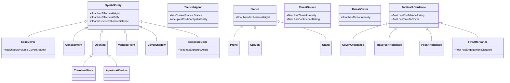
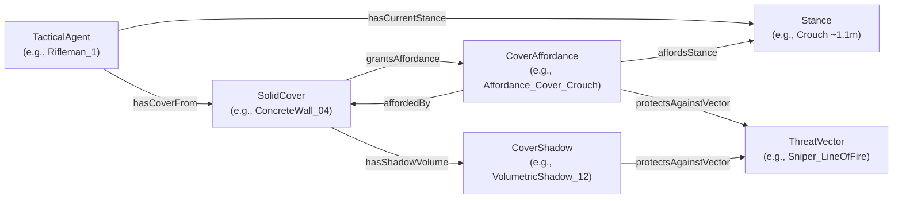
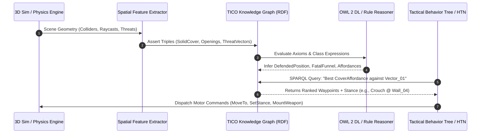

# Tactical Infantry Core Ontology (TICO) Specification

> **Version:** 1.0.0  
> **Status:** Formal OWL 2 Ontology Specification  
> **Base IRI:** `http://arma-ai.org/ontology/tactical-core#`  
> **Prefix:** `tac:`  
> **Target Environment:** Arma 3, Enfusion Engine, Synthetic Tactical & Defense AI Simulations  

---

## 1. Executive Summary & Purpose

The **Tactical Infantry Core Ontology (TICO)** provides a formal, machine-interpretable conceptual foundation for real-time tactical reasoning, spatial affordance evaluation, and micro-tactics coordination in synthetic simulation environments. 

Traditional military AI in commercial game engines relies on ad-hoc heuristics, hardcoded waypoints, or brittle state machines that lack semantic understanding of physical space, ballistic geometry, and threat dynamics. TICO bridges the gap between **sub-symbolic spatial perception** (continuous 3D raycasts, navmeshes, voxel grids, physics colliders) and **symbolic tactical cognition** (threat vectors, defensive postures, bounded exposure traversal, defilade/enfilade engagements).

```
 +-----------------------------------------------------------------------+
 |                 3D Synthetic Environment (Arma / Voxel)               |
 |         (Mesh Colliders, Physics Raycasting, Ballistics Engine)       |
 +-----------------------------------------------------------------------+
                                    │
                                    ▼ (Spatial Feature Extraction)
 +-----------------------------------------------------------------------+
 |               TICO Knowledge Graph (RDF / OWL 2 DL)                   |
 |    - Spatial Entities (SolidCover, Concealment, Openings)             |
 |    - Threat Vectors & Shadow Volumes                                  |
 |    - Gibsonian Affordances (Cover, Traverse, Peek, Fire)              |
 +-----------------------------------------------------------------------+
                                    │
                                    ▼ (DL Reasoning & SPARQL Engine)
 +-----------------------------------------------------------------------+
 |               Tactical Decision Engine (BT / HTN Planner)             |
 |   (Stance Selection, Bounding Overwatch, Slicing the Pie, Defilade)   |
 +-----------------------------------------------------------------------+
```

---

## 2. Foundational Principles & Conceptual Grounding

### 2.1 Gibsonian Ecological Psychology (Affordance Theory)
In James J. Gibson’s ecological psychology, an **affordance** is what the environment provides or furnishes to an agent, relative to the agent's action capabilities (*effectivities*) and current physiological/tactical state.
- Space is not perceived as an abstract Euclidean 3D coordinate frame; rather, a concrete low wall is perceived directly as **"cover-affording in crouch stance"** or **"vault-affording during sprint"**.
- A doorway is perceived as a **"traverse-affording portal"** compounded with a **"fatal-funnel high-exposure risk"**.
- TICO models affordances as **first-class relational entities** (`tac:TacticalAffordance`) linking an agent's biomechanical state (`tac:Stance`), an environmental object (`tac:SpatialEntity`), and an active hazard (`tac:ThreatVector`).

### 2.2 Ballistic & Spatial Geometry
TICO formalizes the fundamental physics of tactical infantry combat:
1. **Ballistic Stopping vs. Optical Occlusion:** Clear distinction between `SolidCover` (penetration resistance $\ge 0.7$, stopping projectiles) and `Concealment` (penetration resistance $< 0.3$, blocking visual Line-of-Sight but transparent to kinetic energy).
2. **Cover Shadows:** The volumetric geometric safe cone ($V_{\text{safe}}$) cast behind a `SolidCover` opposing the incoming trajectory of a `ThreatVector`.
3. **Exposure Cones & Fatal Funnels:** The vulnerable angular volume swept by hostile lines of fire emanating from an opening or threat origin.

---

## 3. Ontology Architecture & Namespaces

### Standard Prefixes & Namespaces
```turtle
@prefix :        <http://arma-ai.org/ontology/tactical-core#> .
@prefix tac:     <http://arma-ai.org/ontology/tactical-core#> .
@prefix rdf:     <http://www.w3.org/1999/02/22-rdf-syntax-ns#> .
@prefix rdfs:    <http://www.w3.org/2000/01/rdf-schema#> .
@prefix owl:     <http://www.w3.org/2002/07/owl#> .
@prefix xsd:     <http://www.w3.org/2001/XMLSchema#> .
@prefix geo:     <http://www.opengis.net/ont/geosparql#> .
@prefix dc:      <http://purl.org/dc/elements/1.1/> .
@prefix dcterms: <http://purl.org/dc/terms/> .
```

---

## 4. Class Taxonomy & Hierarchy

### 4.1 Taxonomy Overview Diagram



### 4.2 Class Descriptions

| Class URI | English Label | French Label | Description |
|---|---|---|---|
| `tac:TacticalAgent` | Tactical Agent | Agent Tactique | Autonomous infantry soldier or human combatant with mobility, posture control, and weapon capabilities. |
| `tac:SpatialEntity` | Spatial Entity | Entité Spatiale | Base class for all physical obstacles, terrain features, geometric cells, and volumetric zones. |
| `tac:SolidCover` | Solid Cover | Abri / Couvert Dur | Ballistic-stopping physical barrier (concrete wall, berm, vehicle engine) casting a safe cover shadow. |
| `tac:Concealment` | Concealment | Masque / Camouflage Visuel | Optical occluder (smoke, bushes, tarpaulin) blocking visual LOS without stopping projectiles. |
| `tac:Opening` | Opening / Breach | Ouverture / Brèche | Discontinuity or void in a structure allowing line-of-sight, projectile traversal, or ingress/egress. |
| `tac:ThresholdDoor` | Threshold Doorway | Seuil de Porte / Porte | Ground-level opening designed for pedestrian transit; primary source of CQB fatal-funnel exposure. |
| `tac:ApertureWindow` | Aperture Window | Fenêtre / Meurtrière / Baie | Elevated aperture providing constrained observation, peeking, and firing sectors while masking lower body. |
| `tac:VantagePoint` | Vantage Point | Point Haut / Dominant | Topologically elevated position offering commanding observation and extended ballistic arcs. |
| `tac:CoverShadow` | Cover Shadow / Safe Volume | Ombre de Couvert | Geometric volume of safety projected behind a solid cover opposing the incoming threat vector. |
| `tac:ExposureCone` | Exposure Cone / Danger Sector | Cône d'Exposition | Volumetric or angular danger sector where an agent is subject to hostile detection or fire. |
| `tac:ThreatSource` | Threat Source | Source de Menace | Hostile entity, MG nest, sniper hide, or uncleared zone generating potential or active threat vectors. |
| `tac:ThreatVector` | Threat Vector | Vecteur de Menace | Directed 3D ray or cone defined by origin, trajectory, range, and lethal severity rating. |
| `tac:Stance` | Infantry Stance / Posture | Posture / Stance | Biomechanical vertical configuration (`Prone`, `Crouch`, `Stand`) controlling height and mobility. |
| `tac:Prone` | Prone Stance | Posture Couchée | Low profile (~0.35m) maximizing ground micro-relief exploitation at the expense of transit speed. |
| `tac:Crouch` | Crouched Stance | Posture Accroupie | Intermediate profile (~1.10m) balancing mobility with protection behind half-walls. |
| `tac:Stand` | Standing Stance | Posture Debout | Upright profile (~1.80m) offering maximum locomotion velocity and visibility over tall obstacles. |
| `tac:TacticalAffordance` | Tactical Affordance | Affordance Tactique | Relational action possibility emerging between agent, spatial entity, and threat environment. |
| `tac:CoverAffordance` | Cover Affordance | Affordance de Couvert | Action possibility enabling an agent in a given stance to be safely occluded from threat vectors. |
| `tac:TraverseAffordance`| Traverse Affordance / Bound | Affordance de Bond | Action possibility allowing rapid transit between two cover waypoints with bounded exposure. |
| `tac:PeekAffordance` | Peek Affordance / Slicing | Affordance de Coup d'Œil | Action possibility allowing incremental angle slicing (pie-slicing) or leaning with minimal exposure. |
| `tac:FireAffordance` | Fire Affordance / Shooting Line| Affordance de Tir | Action possibility providing weapon alignment and line-of-fire towards target with partial body defilade. |

---

## 5. Gibsonian Affordance Relational Model

The tactical reasoning loop operates over a quadruplet: **Agent + Stance + Spatial Geometry + Threat Environment**.



---

## 6. Defined Classes & Description Logic (DL) Axioms

TICO defines several complex tactical concepts using OWL 2 DL equivalent class expressions to enable automatic real-time classification by standard DL reasoners (HermiT, Pellet, Openllet, or Trie-based forward rule engines).

### 6.1 Defended Position (`tac:DefendedPosition`)
A spatial node or waypoint is formally classified as a **Defended Position** if and only if it is a `SpatialEntity` that grants a `CoverAffordance` protecting against at least one active `ThreatVector`:

$$\text{DefendedPosition} \equiv \text{SpatialEntity} \sqcap \exists \text{grantsAffordance}.(\text{CoverAffordance} \sqcap \exists \text{protectsAgainstVector}.\text{ThreatVector})$$

```turtle
tac:DefendedPosition rdf:type owl:Class ;
    owl:equivalentClass [
        rdf:type owl:Class ;
        owl:intersectionOf (
            tac:SpatialEntity
            [
                rdf:type owl:Restriction ;
                owl:onProperty tac:grantsAffordance ;
                owl:someValuesFrom [
                    rdf:type owl:Class ;
                    owl:intersectionOf (
                        tac:CoverAffordance
                        [
                            rdf:type owl:Restriction ;
                            owl:onProperty tac:protectsAgainstVector ;
                            owl:someValuesFrom tac:ThreatVector
                        ]
                    )
                ]
            ]
        )
    ] .
```

### 6.2 Fatal Funnel Opening (`tac:FatalFunnelOpening`)
An opening (doorway or breached entrance) that is directly swept by an active hostile `ThreatSource`:

$$\text{FatalFunnelOpening} \equiv \text{Opening} \sqcap \exists \text{exposesTo}.\text{ThreatSource}$$

```turtle
tac:FatalFunnelOpening rdf:type owl:Class ;
    owl:equivalentClass [
        rdf:type owl:Class ;
        owl:intersectionOf (
            tac:Opening
            [
                rdf:type owl:Restriction ;
                owl:onProperty tac:exposesTo ;
                owl:someValuesFrom tac:ThreatSource
            ]
        )
    ] .
```

### 6.3 Protected Vantage Point (`tac:ProtectedVantagePoint`)
An elevated vantage point that offers both defensive cover and a clear firing sector:

$$\text{ProtectedVantagePoint} \equiv \text{VantagePoint} \sqcap \exists \text{grantsAffordance}.\text{CoverAffordance} \sqcap \exists \text{grantsAffordance}.\text{FireAffordance}$$

```turtle
tac:ProtectedVantagePoint rdf:type owl:Class ;
    owl:equivalentClass [
        rdf:type owl:Class ;
        owl:intersectionOf (
            tac:VantagePoint
            [
                rdf:type owl:Restriction ;
                owl:onProperty tac:grantsAffordance ;
                owl:someValuesFrom tac:CoverAffordance
            ]
            [
                rdf:type owl:Restriction ;
                owl:onProperty tac:grantsAffordance ;
                owl:someValuesFrom tac:FireAffordance
            ]
        )
    ] .
```

---

## 7. Object & Data Properties Specification

### 7.1 Object Properties

| Property URI | Inverse Property | Domain | Range | Characteristics | Semantics |
|---|---|---|---|---|---|
| `tac:hasCoverFrom` | `tac:isCoverFor` | `tac:TacticalAgent` | `tac:SolidCover` | Asymmetric | Current physical obstacle shielding the agent. |
| `tac:isCoverFor` | `tac:hasCoverFrom` | `tac:SolidCover` | `tac:TacticalAgent` | Asymmetric | Inverse of `hasCoverFrom`. |
| `tac:exposesTo` | — | `tac:SpatialEntity` $\cup$ `tac:TacticalAgent` | `tac:ThreatSource` | Asymmetric | Entity/agent is directly visible/targetable by threat. |
| `tac:affordsStance` | — | `tac:TacticalAffordance` $\cup$ `tac:SolidCover` | `tac:Stance` | Asymmetric | Stances compatible with this cover or action. |
| `tac:requiresExposureBudget` | — | `tac:TacticalAffordance` | `tac:ExposureCone` | Asymmetric | Danger sector traversed when executing affordance. |
| `tac:protectsAgainstVector` | — | `tac:CoverAffordance` $\cup$ `tac:SolidCover` $\cup$ `tac:CoverShadow` | `tac:ThreatVector` | Asymmetric | Incoming hostile vector neutralized by this cover. |
| `tac:hasOpening` | — | `tac:SpatialEntity` | `tac:Opening` | Asymmetric | Portal or window present in a wall or building. |
| `tac:isAdjacentTo` | `tac:isAdjacentTo` | `tac:SpatialEntity` | `tac:SpatialEntity` | Symmetric | Topological contiguity between spatial cells/covers. |
| `tac:hasThreatOrigin` | `tac:originatesVector` | `tac:ThreatVector` | `tac:ThreatSource` | Asymmetric | Hostile actor or zone generating the threat vector. |
| `tac:originatesVector` | `tac:hasThreatOrigin` | `tac:ThreatSource` | `tac:ThreatVector` | Asymmetric | Inverse of `hasThreatOrigin`. |
| `tac:hasShadowVolume` | `tac:isShadowOf` | `tac:SolidCover` | `tac:CoverShadow` | Asymmetric | Safe shadow volume cast behind the solid barrier. |
| `tac:isShadowOf` | `tac:hasShadowVolume` | `tac:CoverShadow` | `tac:SolidCover` | Asymmetric | Inverse of `hasShadowVolume`. |
| `tac:grantsAffordance` | `tac:affordedBy` | `tac:SpatialEntity` | `tac:TacticalAffordance` | Asymmetric | Relates physical space to available action affordance. |
| `tac:affordedBy` | `tac:grantsAffordance` | `tac:TacticalAffordance` | `tac:SpatialEntity` | Asymmetric | Inverse of `grantsAffordance`. |
| `tac:hasCurrentStance` | — | `tac:TacticalAgent` | `tac:Stance` | Functional | Instantaneous posture of the agent. |
| `tac:occupiesPosition` | `tac:isOccupiedBy` | `tac:TacticalAgent` | `tac:SpatialEntity` | Functional | Current waypoint/cell occupied by the agent. |
| `tac:isOccupiedBy` | `tac:occupiesPosition` | `tac:SpatialEntity` | `tac:TacticalAgent` | Asymmetric | Inverse of `occupiesPosition`. |
| `tac:targetsSectorOrThreat`| — | `tac:FireAffordance` | `tac:ThreatSource` $\cup$ `tac:SpatialEntity` | Asymmetric | Firing sector or target assigned to a fire affordance. |

### 7.2 Data Properties

| Property URI | Domain | Range | Unit / Bounds | Definition & Tactical Purpose |
|---|---|---|---|---|
| `tac:hasEffectiveHeight` | `tac:SpatialEntity` | `xsd:float` | Meters ($m \ge 0$) | Physical vertical height of wall, window sill, or berm. |
| `tac:hasEffectiveWidth` | `tac:SpatialEntity` | `xsd:float` | Meters ($m \ge 0$) | Horizontal span of doorway, window opening, or parapet. |
| `tac:hasPenetrationResistance` | `tac:SpatialEntity` | `xsd:float` | $[0.0 \dots 1.0]$ | Ballistic stopping power ($0.0=$ none, $0.8=$ brick, $1.0=$ reinforced concrete). |
| `tac:hasTimeToCover` | `tac:TacticalAffordance` | `xsd:float` | Seconds ($s \ge 0$) | Sprint/crawl duration required to reach the cover shadow. |
| `tac:hasExposureAngle` | `tac:ExposureCone` $\cup$ `tac:TacticalAffordance` $\cup$ `tac:Opening` | `xsd:float` | Degrees ($[0^\circ \dots 360^\circ]$) | Angular arc of the danger sector or field of view. |
| `tac:hasThreatIntensity` | `tac:ThreatSource` $\cup$ `tac:ThreatVector` | `xsd:float` | $[0.0 \dots 1.0]$ | Normalized severity score (suppression level, caliber, fire rate). |
| `tac:hasConfidenceRating` | `tac:ThreatSource` $\cup$ `tac:TacticalAffordance` $\cup$ `tac:ThreatVector` | `xsd:float` | $[0.0 \dots 1.0]$ | Epistemic certainty of sensor/intelligence data. |
| `tac:hasMaxPostureHeight` | `tac:Stance` | `xsd:float` | Meters ($m > 0$) | Nominal clearance height for stance ($0.35m$ Prone, $1.10m$ Crouch, $1.80m$ Stand). |
| `tac:hasEngagementDistance` | `tac:FireAffordance` | `xsd:float` | Meters ($m \ge 0$) | Range along firing vector to target position. |

---

## 8. Close Quarters Battle (CQB) & Micro-Tactics Scenarios

### 8.1 Slicing the Pie (Corner Peeking)
When clearing a corner or doorway, an infantry agent uses `tac:PeekAffordance`. By stepping outward tangentially at increments ($\Delta \theta$), the agent reveals narrow slivers of the room while maintaining `tac:SolidCover` for the rest of their silhouette.

```
       +-----------------------+
       |   Uncleared Room      |
       |                       |
       |      [ Threat_MG ]    |
       |           \           |
       |            \ Threat   |
       |             \ Vector  |
       |              \        |
+======+               \       +======+
| Wall                  \      | Wall |
+======+                 \     +======+
                          \    <-- Exposure Cone (Fatal Funnel)
             [Peek Point]  \
                  O <-------+ (Agent slicing angle incrementally)
                 /|\
                 / \
```

### 8.2 Bounding Overwatch (Cover-to-Cover Traversal)
When an agent moves between two positions under fire, the planner queries `tac:TraverseAffordance` linking `Cover_A` and `Cover_B`. The algorithm selects the bound that minimizes $\int \text{ExposureCone} \cdot dt$, balancing `hasTimeToCover` against suppression fire provided by squad members.

---

## 9. Real-Time Semantic Reasoning Pipeline



---

## 10. Practical SPARQL Query Examples

### 10.1 Query 1: Find Optimal Cover Affordance Against a Specific Threat Vector
Find all available cover affordances that neutralize incoming `ThreatVector_Alpha`, returning the required stance, time to cover, and barrier penetration resistance:

```sparql
PREFIX tac: <http://arma-ai.org/ontology/tactical-core#>
PREFIX xsd: <http://www.w3.org/2001/XMLSchema#>

SELECT ?affordance ?cover ?stance ?timeToCover ?resistance
WHERE {
    ?affordance a tac:CoverAffordance ;
                tac:affordedBy ?cover ;
                tac:affordsStance ?stance ;
                tac:protectsAgainstVector tac:ThreatVector_Alpha ;
                tac:hasTimeToCover ?timeToCover .
    
    ?cover tac:hasPenetrationResistance ?resistance .
    
    FILTER (?resistance >= 0.7 && ?timeToCover < 3.5)
}
ORDER BY ?timeToCover DESC(?resistance)
LIMIT 3
```

### 10.2 Query 2: Identify Fatal Funnel Ingress Points with Active Exposure
Identify all doorways or windows exhibiting high exposure angles to hostile threat sources:

```sparql
PREFIX tac: <http://arma-ai.org/ontology/tactical-core#>

SELECT ?opening ?threat ?exposureAngle ?threatIntensity
WHERE {
    ?opening a tac:Opening ;
             tac:exposesTo ?threat ;
             tac:hasExposureAngle ?exposureAngle .
             
    ?threat tac:hasThreatIntensity ?threatIntensity .
    
    FILTER (?threatIntensity > 0.5 && ?exposureAngle > 30.0)
}
ORDER BY DESC(?threatIntensity) DESC(?exposureAngle)
```

### 10.3 Query 3: Select Protected Vantage Points for Fire Support
Find positions providing firing lines on `ThreatSource_Bravo` while keeping the shooter shielded behind solid cover:

```sparql
PREFIX tac: <http://arma-ai.org/ontology/tactical-core#>

SELECT ?vantagePoint ?fireAffordance ?stance ?distance
WHERE {
    ?vantagePoint a tac:ProtectedVantagePoint ;
                  tac:grantsAffordance ?fireAffordance ;
                  tac:grantsAffordance ?coverAffordance .
                  
    ?fireAffordance a tac:FireAffordance ;
                    tac:targetsSectorOrThreat tac:ThreatSource_Bravo ;
                    tac:hasEngagementDistance ?distance ;
                    tac:affordsStance ?stance .
                    
    ?coverAffordance a tac:CoverAffordance .
}
ORDER BY ?distance
```

---

## 11. Maintenance, Extensibility & Future Work

1. **GeoSPARQL / Spatial-3D Extension:** Future revisions will formally integrate `geo:hasGeometry` with 3D WKT/GML geometries for volumetric polygon intersection queries.
2. **Dynamic Suppression Degradation:** Integration of temporal data properties (`tac:hasSuppressionDecayRate`, `tac:lastFiredTimestamp`) to dynamically model threat vector evaporation over time.
3. **Multi-Agent Squad Formations:** Extending affordances to squad-level collective affordances (e.g., `tac:BoundingOverwatchAffordance`, `tac:CrossfireAffordance`).
